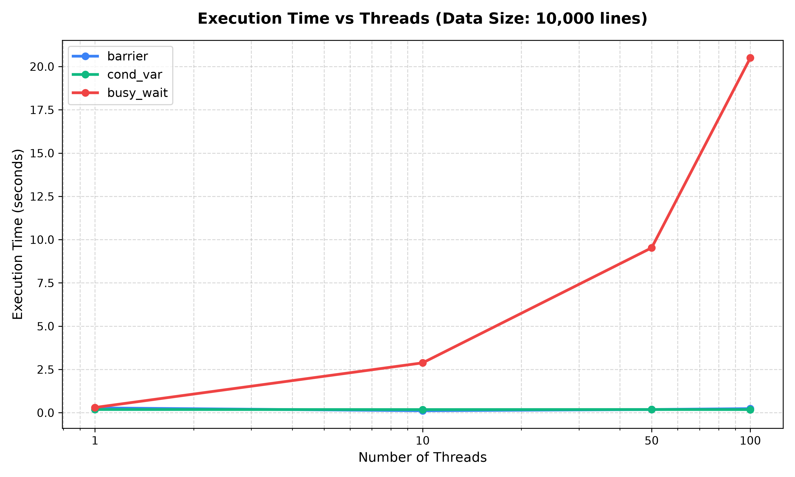
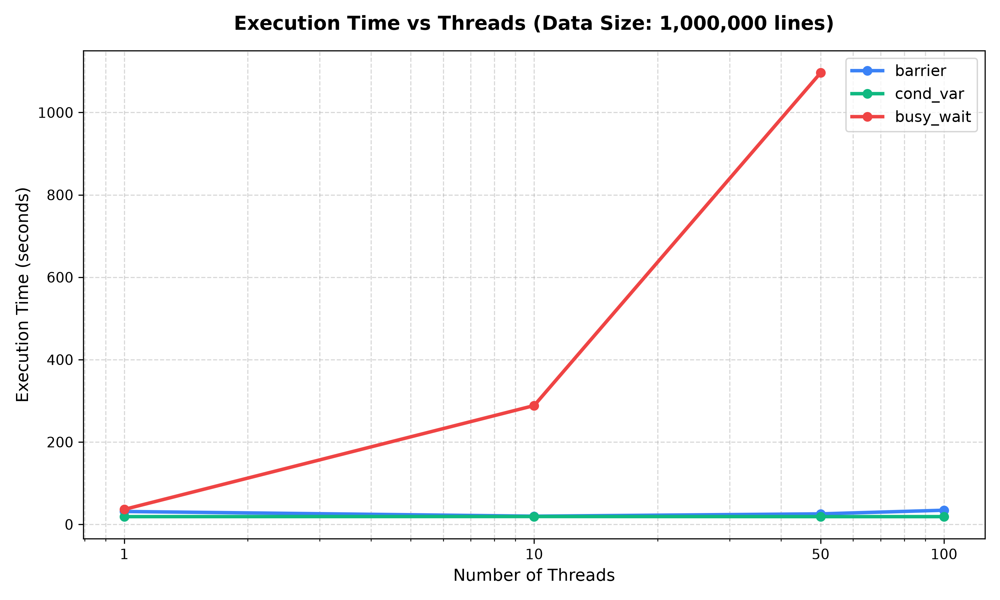
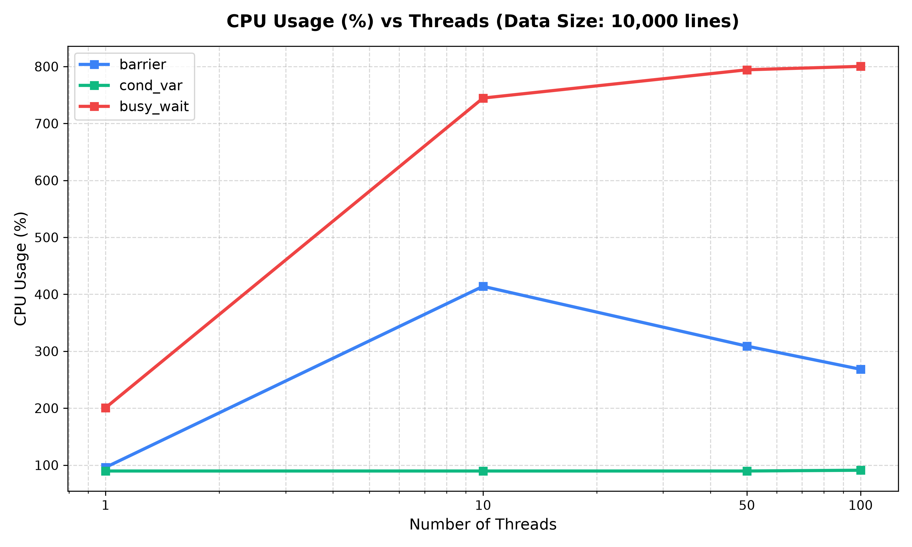
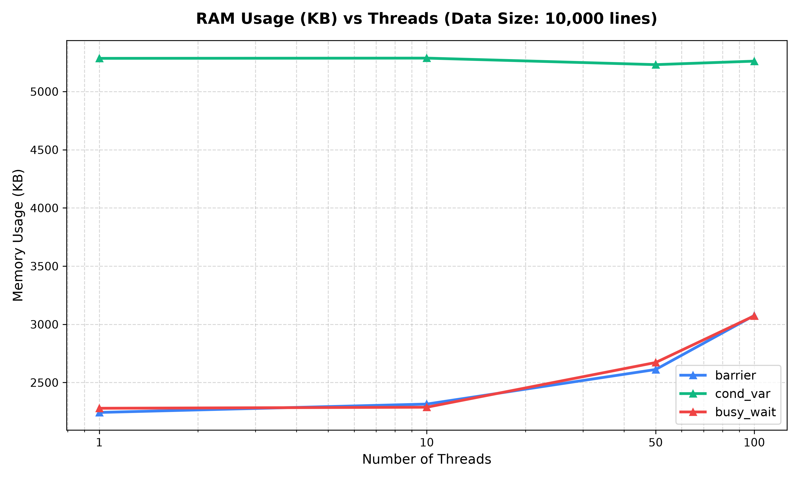

# Parallel Data Preprocessing System

### Universidad del Magdalena - Systems Engineering
**Course:** Operating Systems
**Topic:** Synchronization and Parallel Processing with `pthread`
**Authors:** Jiménez Rossimar & Rincones Carlos

---

## Objective

Design and implement a multi-threaded solution that performs **text data preprocessing** tasks in parallel, applying common NLP (Natural Language Processing) techniques. The system compares three different synchronization mechanisms:
- **Barriers** (`pthread_barrier_t`)
- **Condition Variables** (`pthread_cond_t`)
- **Busy Waiting** (using turn flags)

---

## Preprocessing Techniques

Each thread processes segments of the matrix loaded into memory, applying the following sequential preprocessing operations:
1. **Lowercase Conversion**: Translates uppercase characters to lowercase.
2. **Punctuation Removal**: Filters out common punctuation marks.
3. **Digit/Number Removal**: Discards numerical values.
4. **Stopwords Elimination**: Filters out frequent grammatical particles (using the word list in [data/stopwords.txt](file:///home/xlancet/Codes/low-level/parallel-data-preprocessig-system/data/stopwords.txt)).

---

## System Architecture

The application adopts a block-processing (chunking) paradigm for large scale inputs:
- Data is represented as a 2D matrix of dimensions `N x M`, where each row represents a distinct text comment.
- For **Barriers** and **Busy Waiting** solutions, processing is chunk-based (`MAX_COMMENTS_TO_READ` = 100 rows at a time). Threads persist throughout the program lifecycle to minimize context-switching and creation overhead.
- For the **Condition Variable** solution, the system operates as a 4-stage sequential pipeline where each thread represents one phase of preprocessing (Lowercase, Digits, Punctuation, and Stopwords) working on the entire dataset.

---

## Project Structure

```
├── data/                  # Input datasets and stopwords list
│   ├── in0.txt to in4.txt # Text files (sizes: 10 to 1,000,000 comments)
│   └── stopwords.txt      # Words to filter out during preprocessing
├── include/               # C Header files
│   ├── barrier_solution.h
│   ├── busy_wait_solution.h
│   ├── cond_var_solution.h
│   └── utils.h
├── src/                   # C Source files
│   ├── main.c
│   ├── barrier_solution.c
│   ├── busy_wait_solution.c
│   ├── cond_var_solution.c
│   └── utils.c
├── plots/                 # Generated performance charts
├── benchmark.sh           # Benchmarking automation script
├── plot_results.py        # Chart generation script (matplotlib/pandas)
└── results.csv            # Benchmarking data (Method, Threads, Data Size, Time, CPU, RAM)
```

---

## Compilation and Execution

### Compilation

Compile the project using `gcc`:
```bash
gcc -Wall -Wextra src/*.c -Iinclude -o preprocess -lpthread
```

### Execution

Run the compiled executable with:
```bash
./preprocess <num_threads> <input_file> <method: barrier|cond_var|busy_wait>
```

Example:
```bash
./preprocess 4 data/in2.txt barrier
```

---

## Benchmarks & Results

An automated benchmark script was executed comparing the synchronization methods across different thread counts (`1`, `10`, `50`, `100`) and data sizes (ranging from `10` up to `1,000,000` rows).

To execute the benchmark and regenerate the charts:
```bash
# 1. Run the benchmark script
./benchmark.sh

# 2. Generate updated charts
python3 plot_results.py
```

### Performance Analysis

#### 1. Execution Time
Below is the execution time comparison across different thread counts for a dataset size of 10,000 lines (where all three methods are applicable) and 1,000,000 lines (barrier and busy_wait comparison):

| 10,000 Comments | 1,000,000 Comments |
| :---: | :---: |
|  |  |

* **Barrier** represents the most efficient method, achieving significant speedups when scaling threads, particularly with large datasets.
* **Busy Wait** shows comparable execution time to barriers, but does so at a massive cost in system resources due to active polling.
* **Condition Variable** has longer execution times because it uses a sequential stage pipeline across the entire file, requiring complete copies between stages instead of chunked parallel processing.

#### 2. CPU Usage
The CPU percentage highlights the efficiency cost of busy-waiting:



* **Busy Wait** consumes a massive amount of CPU cycles (scaling linearly with the number of active polling threads), resulting in pegging CPU cores at 100% usage even when waiting for inputs.
* **Barrier** and **Condition Variable** leverage operating system synchronization primitives to sleep threads, maintaining efficient CPU utilization.

#### 3. Memory (RAM) Consumption
Memory usage (in KB) shows how allocations differ between algorithms:



* **Barrier** and **Busy Wait** scale extremely well in terms of memory footprint, processing blocks in chunks of 100.
* **Condition Variable** requires loading the entire file into memory at once to pipeline the stages, making its RAM consumption scale directly with dataset size.
